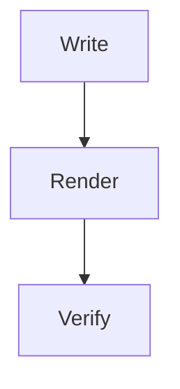

# Content Rendering Implementation Plan

> **For agentic workers:** REQUIRED SUB-SKILL: Use superpowers:subagent-driven-development (recommended) or superpowers:executing-plans to implement this plan task-by-task. Steps use checkbox (`- [ ]`) syntax for tracking.

**Goal:** Improve rendered post content with stronger heading hierarchy, self-linking headings, clickable tag/series metadata, Roboto Mono code styling, broader shortcode fixture coverage, and Mermaid support that follows the hugo-narrow pattern.

**Architecture:** This pass works at the content-rendering layer. Hugo render hooks handle linked headings and Mermaid blocks, the post metadata partial becomes navigable, prose/code styling is refined in the shared CSS, and the shortcode example fixture expands to cover embedded shortcode output with integration tests proving the rendered results are visible.

**Tech Stack:** Hugo templates, Hugo render hooks, TailwindCSS, Playwright, exampleSite fixtures, Mermaid via conditional feature partial

---

## File Structure Map

- Modify: `assets/css/app.css` - add prose-level heading hierarchy, linkable heading affordances, and `Roboto Mono` styling for code/shortcode blocks
- Modify: `layouts/single.html` - ensure content wrapper remains compatible with heading-link and prose styling changes
- Modify: `layouts/_partials/post-meta.html` - convert tag and series metadata into taxonomy links
- Create: `layouts/_markup/render-heading.html` - render self-linking headings for content
- Create: `layouts/_markup/render-codeblock-mermaid.html` - render Mermaid code fences using the hugo-narrow-style render-hook approach
- Create: `layouts/_partials/features/mermaid.html` - conditionally load Mermaid when pages contain Mermaid blocks
- Modify: `layouts/baseof.html` - include Mermaid feature partial in the document shell if needed
- Modify: `exampleSite/content/posts/shortcodes-builtins.md` - expand fixture to include embedded Hugo shortcodes plus Mermaid example content
- Modify: `tests/e2e/theme.spec.js` - add integration coverage for linked headings, clickable metadata, shortcode visibility, and Mermaid rendering

### Task 1: Add Self-Linking Headings And Clickable Metadata

**Files:**
- Create: `layouts/_markup/render-heading.html`
- Modify: `layouts/_partials/post-meta.html`
- Modify: `tests/e2e/theme.spec.js`

- [ ] **Step 1: Write the failing integration coverage**

```js
test('post headings link to their own anchors', async ({ page }) => {
  await page.goto('/posts/toc-stress-post/')

  const headingLink = page.locator('#large-section-one').locator('a[href="#large-section-one"]')
  await expect(headingLink).toBeVisible()
  await expect(headingLink).toContainText('Large Section One')
})

test('post metadata tags and series are clickable taxonomy links', async ({ page }) => {
  await page.goto('/posts/series-part-1/')

  await expect(page.getByRole('link', { name: 'fixture-series', exact: true })).toHaveAttribute('href', '/series/fixture-series/')
  await expect(page.getByRole('link', { name: 'series', exact: true })).toHaveAttribute('href', '/tags/series/')
})
```

- [ ] **Step 2: Run test to verify it fails**

Run: `npm run test:e2e -- tests/e2e/theme.spec.js --grep "headings link to their own anchors|metadata tags and series are clickable"`
Expected: FAIL because headings are plain text and metadata values are not links yet

- [ ] **Step 3: Write the minimal implementation**

```go-html-template
<!-- layouts/_markup/render-heading.html -->
<h{{ .Level }} id="{{ .Anchor | safeURL }}">
  <a href="#{{ .Anchor | safeURL }}" class="group inline-flex items-baseline gap-2 no-underline">
    <span>{{ .Text | safeHTML }}</span>
    <span aria-hidden="true" class="text-slate-400 opacity-0 transition group-hover:opacity-100">#</span>
  </a>
</h{{ .Level }}>
```

```go-html-template
<!-- layouts/_partials/post-meta.html -->
<div class="flex flex-wrap gap-3 text-sm text-slate-500">
  <span>{{ .Date | time.Format ":date_medium" }}</span>
  <span class="inline-flex items-center gap-1.5">
    {{ partial "icon.html" (dict "name" "timer" "class" "h-4 w-4") }}
    <span>{{ .ReadingTime }} min</span>
  </span>
  {{ with .Params.tags }}
    {{ range . }}
      <a href="{{ (printf "tags/%s/" .) | relLangURL }}">{{ . }}</a>
    {{ end }}
  {{ end }}
  {{ with .Params.series }}
    {{ range . }}
      <a href="{{ (printf "series/%s/" .) | relLangURL }}">{{ . }}</a>
    {{ end }}
  {{ end }}
</div>
```

- [ ] **Step 4: Run test to verify it passes**

Run: `npm run test:e2e -- tests/e2e/theme.spec.js --grep "headings link to their own anchors|metadata tags and series are clickable"`
Expected: PASS

- [ ] **Step 5: Commit**

```bash
git add layouts/_markup/render-heading.html layouts/_partials/post-meta.html tests/e2e/theme.spec.js
git commit -m "feat: add linked headings and metadata links"
```

### Task 2: Improve Content Hierarchy And Code Block Typography

**Files:**
- Modify: `assets/css/app.css`
- Modify: `layouts/single.html`
- Modify: `tests/e2e/theme.spec.js`

- [ ] **Step 1: Write the failing integration coverage**

```js
test('content headings use distinct hierarchy styles', async ({ page }) => {
  await page.goto('/posts/toc-stress-post/')

  const h2Size = await page.locator('#large-section-one').evaluate((node) => getComputedStyle(node).fontSize)
  const h3Size = await page.locator('#nested-layer-a').evaluate((node) => getComputedStyle(node).fontSize)
  const h4Size = await page.locator('#deep-detail-i').evaluate((node) => getComputedStyle(node).fontSize)

  expect(h2Size).not.toBe(h3Size)
  expect(h3Size).not.toBe(h4Size)
})

test('code blocks use Roboto Mono', async ({ page }) => {
  await page.goto('/posts/shortcodes-builtins/')

  const codeFont = await page.locator('article .highlight code').evaluate((node) => getComputedStyle(node).fontFamily)
  expect(codeFont).toContain('Roboto Mono')
})
```

- [ ] **Step 2: Run test to verify it fails**

Run: `npm run test:e2e -- tests/e2e/theme.spec.js --grep "distinct hierarchy styles|Roboto Mono"`
Expected: FAIL because content heading levels and code block typography are not explicitly differentiated yet

- [ ] **Step 3: Write the minimal implementation**

```css
/* assets/css/app.css */
@import url('https://fonts.googleapis.com/css2?family=Lato:wght@400;700;800&family=Roboto+Mono:wght@400;500&display=swap');

#post-content .prose h2 { font-size: 2rem; margin-top: 2.5rem; margin-bottom: 1rem; }
#post-content .prose h3 { font-size: 1.5rem; margin-top: 2rem; margin-bottom: 0.75rem; }
#post-content .prose h4 { font-size: 1.125rem; margin-top: 1.5rem; margin-bottom: 0.5rem; }
#post-content .prose pre,
#post-content .prose code,
#post-content .prose .highlight code {
  font-family: 'Roboto Mono', monospace;
}
```

```go-html-template
<!-- layouts/single.html -->
<div class="prose prose-slate max-w-none">{{ .Content }}</div>
```

- [ ] **Step 4: Run test to verify it passes**

Run: `npm run test:e2e -- tests/e2e/theme.spec.js --grep "distinct hierarchy styles|Roboto Mono"`
Expected: PASS

- [ ] **Step 5: Commit**

```bash
git add assets/css/app.css layouts/single.html tests/e2e/theme.spec.js
git commit -m "style: refine content hierarchy and code typography"
```

### Task 3: Add Mermaid Support Following The Hugo-Narrow Pattern

**Files:**
- Create: `layouts/_markup/render-codeblock-mermaid.html`
- Create: `layouts/_partials/features/mermaid.html`
- Modify: `layouts/baseof.html`
- Modify: `tests/e2e/theme.spec.js`

- [ ] **Step 1: Write the failing integration coverage**

```js
test('mermaid code blocks render visible diagram output', async ({ page }) => {
  await page.goto('/posts/shortcodes-builtins/')

  await expect(page.locator('.mermaid')).toHaveCount(0)
  await expect(page.locator('svg[id^="mermaid-"]')).toBeVisible()
})
```

- [ ] **Step 2: Run test to verify it fails**

Run: `npm run test:e2e -- tests/e2e/theme.spec.js --grep "mermaid code blocks render visible diagram output"`
Expected: FAIL because Mermaid render hooks and loader partial do not exist yet

- [ ] **Step 3: Write the minimal implementation**

```go-html-template
<!-- layouts/_markup/render-codeblock-mermaid.html -->
<pre class="mermaid">
  {{ .Inner | htmlEscape | safeHTML }}
</pre>
{{ .Page.Store.Set "hasMermaid" true }}
```

```go-html-template
<!-- layouts/_partials/features/mermaid.html -->
{{ if .Store.Get "hasMermaid" }}
  <script type="module">
    import mermaid from "https://cdn.jsdelivr.net/npm/mermaid@11/dist/mermaid.esm.min.mjs";
    mermaid.initialize({ startOnLoad: true, securityLevel: "loose" });
  </script>
{{ end }}
```

```go-html-template
<!-- layouts/baseof.html -->
{{ partial "features/mermaid.html" . }}
```

- [ ] **Step 4: Run test to verify it passes**

Run: `npm run test:e2e -- tests/e2e/theme.spec.js --grep "mermaid code blocks render visible diagram output"`
Expected: PASS

- [ ] **Step 5: Commit**

```bash
git add layouts/_markup/render-codeblock-mermaid.html layouts/_partials/features/mermaid.html layouts/baseof.html tests/e2e/theme.spec.js
git commit -m "feat: add mermaid content rendering"
```

### Task 4: Expand Shortcode Fixture With Embedded Shortcodes And Final Verification

**Files:**
- Modify: `exampleSite/content/posts/shortcodes-builtins.md`
- Modify: `tests/e2e/theme.spec.js`

- [ ] **Step 1: Write the failing integration coverage**

```js
test('shortcode fixture renders all supported embedded shortcode outputs visibly', async ({ page }) => {
  await page.goto('/posts/shortcodes-builtins/')

  await expect(page.locator('iframe[title*="YouTube"], iframe[src*="youtube.com"]')).toHaveCount(1)
  await expect(page.locator('blockquote.twitter-tweet, iframe[src*="twitter"], iframe[src*="x.com"]')).toHaveCount(1)
  await expect(page.locator('iframe[src*="instagram.com"]')).toHaveCount(1)
  await expect(page.locator('svg[id^="mermaid-"]')).toBeVisible()
})
```

- [ ] **Step 2: Run test to verify it fails**

Run: `npm run test:e2e -- tests/e2e/theme.spec.js --grep "all supported embedded shortcode outputs visibly"`
Expected: FAIL because the shortcode fixture does not yet include the embedded shortcode examples

- [ ] **Step 3: Write the minimal implementation**

```md
---
title: Built-In Shortcodes Post
date: 2026-04-05
summary: A fixture covering supported built-in Hugo shortcodes.
tags: [shortcodes, hugo, testing, fixture]
featuredImage: /images/post-1.jpg
---

## Overview

This post exists to exercise built-in shortcode rendering in the theme.


func main() {
  println("hello from shortcode fixture")
}


## YouTube



## X Or Twitter



## Instagram



## Mermaid



## More Content

This section keeps the post from being only shortcode blocks.
```

- [ ] **Step 4: Run the full verification suite**

Run: `npm run build && npm run test:e2e`
Expected: PASS

- [ ] **Step 5: Commit**

```bash
git add exampleSite/content/posts/shortcodes-builtins.md tests/e2e/theme.spec.js
git commit -m "test: expand shortcode fixture coverage"
```

## Self-Review

### Spec Coverage

- Stronger heading hierarchy in post content: Task 2
- Self-linking headings: Task 1
- Clickable tag and series metadata: Task 1
- Roboto Mono for code blocks: Task 2
- Embedded shortcode fixture expansion: Task 4
- Mermaid support following hugo-narrow pattern: Task 3
- Integration coverage for visible shortcode output: Tasks 3 and 4

No spec gaps remain.

### Placeholder Scan

- No `TODO` or `TBD` placeholders remain.
- Each task has exact file paths, commands, and concrete code targets.
- Mermaid implementation instructions reference the actual pattern explicitly instead of saying “similar to hugo-narrow.”

### Type Consistency

- Metadata partial remains the single place for clickable tags/series.
- Mermaid support consistently uses the render-hook plus feature-partial approach.
- The shortcode fixture remains `exampleSite/content/posts/shortcodes-builtins.md` throughout the plan.
