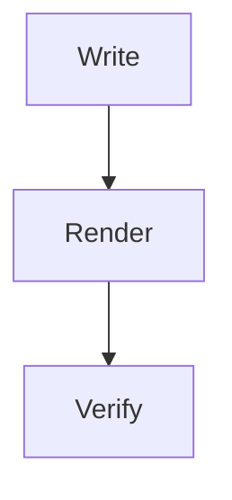

## Overview

This post exists to exercise built-in shortcode rendering in the theme.


func main() {
  println("hello from shortcode fixture")
}


## Structured Content


This copy stays visible because the details shortcode starts expanded.




## Parameters And Links

The site description comes from the param shortcode: {}.

[First Post via ref shortcode]({})

[Second Post via relref shortcode]({})



## YouTube



## Vimeo



## X Or Twitter



## Instagram



## Mermaid

## Message

Inline notice rendered through a Hugo shortcode example.

## More Content

This section keeps the post from being only shortcode blocks.
